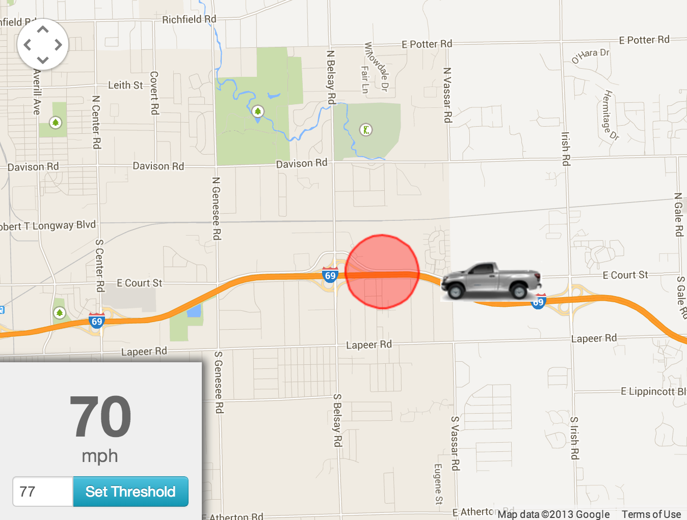
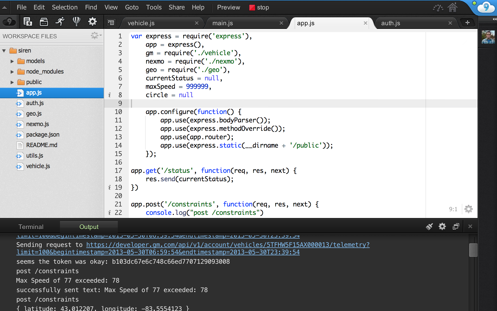

Behind the scenes of "Siren"
---

>a vehicle location hack powered by GM, Nexmo, and Cloud9

I'm a sucker for hackathons, at least the true "hack"-athons, which are different than the "I'm really here to pitch my latest startup idea so let me walk you through the deck"-athons that have become common. Thankfully, the Gluecon event was definitely the former. There's something refershing about the quick and dirty prototyping spirit, and the lack of concern for security, scalability, maintainable code, or commercial viability. I've already confessed that (I don't like writing tests)[http://blog.strongloop.com/how-to-test-an-api-with-node-js/], and a hackathon is the perfect excuse to skip all that.

Meeting new people, trying out new technologies, and thriving on a bit of friendly competition are all great reasons to participate. And of courses the prizes don't hurt. :)

Last week at (Gluecon)[http://www.gluecon.com/2013/] I teamed up with native Coloradoan (Aaron Nielsen)[http://www.linkedin.com/in/aaronmnielsen/], whom I met the first evening.

## Siren

Our hack was a little bit like [Find My Friends](http://www.apple.com/icloud/features/find-my-friends.html) for your car. We built a simple map-based interface that allows you to set two kinds of triggers: speed limits and geo-fences. With the soon-to-be-released [GM Remote API](https://developer.gm.com/apis/remote), you can poll for realtime telemetry data and find out where your vehicle is, how fast its traveling, and in what direction.

### Cloud9

Neither of us had done much with [Cloud9 IDE](https://c9.io) before, so we thought this would be a great chance to test it out. On the whole, it's really impressive how nice the coding experience is for something just running in a browser. We had a couple of hiccups where we were editing the same file and had to coordinate saves, but it was no more annoying than working out a merge in git.

The added bonus is that our code was already "deployed."

### GM

Being the lazy developer that I am, I really like APIs that require nothing more than a `key` parameter included in your requests. The OAuth style of GM's API requires more than that, but it wasn't too bad once we got it set up. The tokens expire every 15 minutes, so we just added this check:

`if (res.statusCode == 401)`

and repeated the call after retrieving a fresh token.

### Nexmo

Twilio has sponsored just about every hackathon I've participted in over the past 3 years. I've used them in many small hacks and a couple of production applications. [Nexmo](http://nexmo.com) describes themselves as a "wholesale" SMS API, and that's a pretty accurate summary; their rates are cheaper, they have better international support, and their developer experience - while adequate - lacks the level of polish and friendliness that you get from Twilio. Both of these companies tempted participants with prizes, but who doesn't love an underdog? We decided to give Nexmo a shot.

I found one big advantage and one drawback to using Nexmo. The advantage is that all incoming SMS messages are *free*. That could be huge for certain applications. The downside is that you can't directly respond to an incoming SMS like you can with Twilio (via [TwiML](http://www.twilio.com/docs/api/twiml)). It's not that I mind writing one line of `send` code, but the catch is that you have to be authorized to send through that number. This makes it trickier to write generic multi-user services that any SMS number can interact with, but it didn't matter for this particular hack.

### Google Maps & Geolib

Google Maps is arguably the reigning champ of mashups in terms of sheer number of inclusions. The only thing that trips me up when I work with the maps API is weeding through documentation and samples that are outdated because they're based on older versions.

I always like starting with the [Styled Maps Wizard](http://gmaps-samples-v3.googlecode.com/svn/trunk/styledmaps/wizard/index.html) to strip out some labels and features for a cleaner simpler map.

I've done a bit of geo work using the handy built-in functions of MongoDB, but Aaron found us a great little Node.js library aptly named [Geolib](https://github.com/manuelbieh/Geolib). Thanks to the `isPointInCircle` method, it was a snap to set up the geo-fence triggers.

### It's not about the money, but...

GM gave out two generous cash (literally a stack of bills) prizes, and we were lucky enough to win one! Our bet on Nexmo also paid off since they kicked in a Nexus 4.

Thanks again to Gluecon and all the hackathon sponsors.
